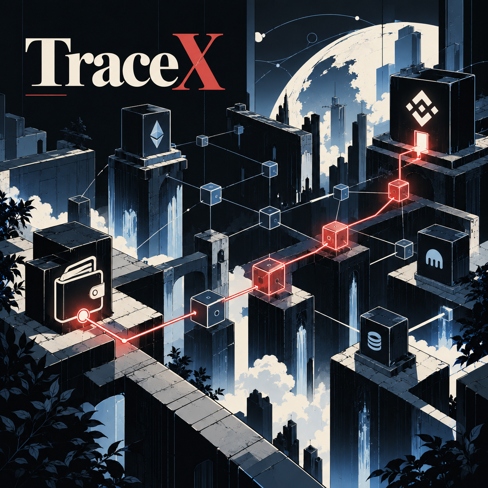
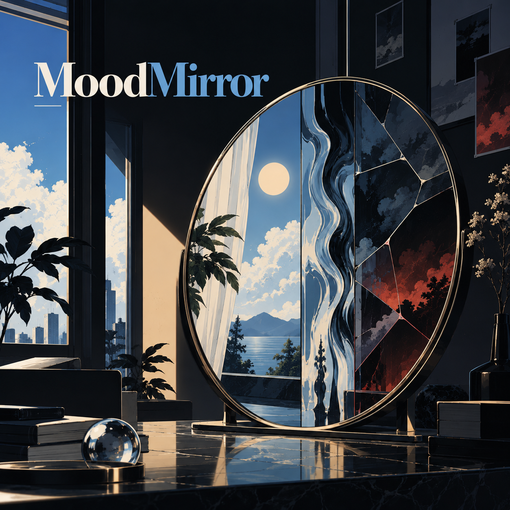
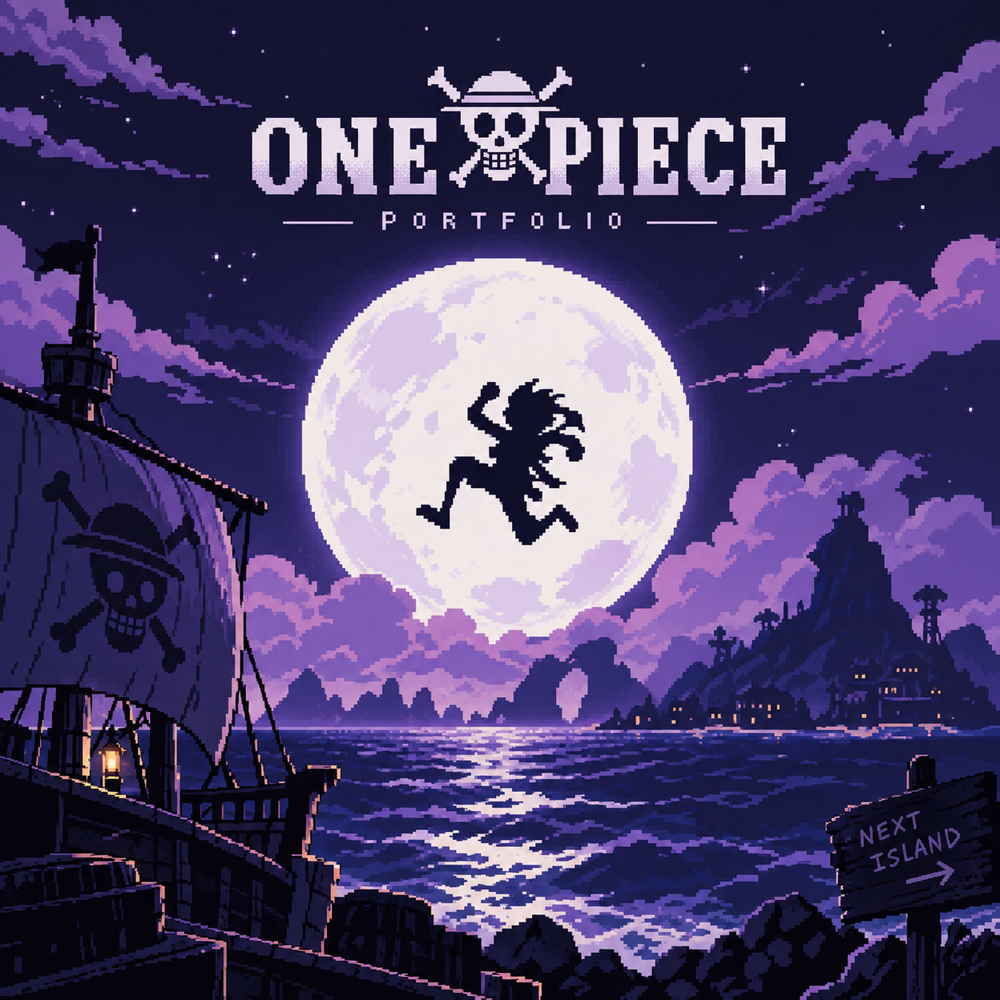

  

---

# About Me

I'm an Information Technology student and software builder interested in creating things that sit somewhere between engineering, design, and creativity.

I enjoy working across the stack, from shaping interfaces to building the systems behind them. My interests span software engineering, AI, blockchain, product development, game development, visual design, and storytelling.

I've worked on hackathon projects, full-stack applications, experimental web experiences, and community-driven projects. I like learning by building, and I tend to keep refining an idea long after the first version works.

Right now, I'm focused on becoming a stronger software engineer, building more ambitious products, and turning ideas into things people can actually use.

---

# 🚀 Selected Work

| [TraceX](https://github.com/apoorvgarewal07/TraceX) | [MoodMirror](https://github.com/anveshr312-bit/moodmirror-web) | [One Piece Portfolio](https://github.com/anveshr312-bit/onepiece-portfolio-anvesh) |
| :---: | :---: | :---: |
|  |  |  |
| `Next.js` `FastAPI` `Neo4j` | `JavaScript` `Web` `AI` | `Next.js` `TypeScript` `Three.js` |

---

# Tech Stack

---

# What I'm Up To

🔭 **I'm currently working on**  
TraceX, full-stack products, and experimental web experiences.

👯 **I'm looking to collaborate on**  
Interesting open-source projects, AI tools, and product ideas that are worth building.

🤝 **I'm looking for help with**  
Turning ambitious ideas into scalable, polished products.

🌱 **I'm currently learning**  
Distributed systems, backend architecture, AI/ML, and game development.

💬 **Ask me about**  
Ideas, projects, anime, game development, design, storytelling, and the rabbit holes I fall into while building things.

⚡ **Fun fact**  
I rarely leave an idea alone once it gets stuck in my head.

---

# More About Me

<b>Education</b>

 

**B.Tech — Information Technology**  
Acropolis Institute of Technology and Research, Indore

<b>Experience</b>

 

**Full Stack Intern — Indian Railway R³P**  
May – July 2026

<b>Interests</b>

 

Software engineering • AI • Blockchain • Game development • UI/UX • Storytelling • Anime • Marvel/DC • Video editing

---

# Connect

---

# 📊 GitHub Activity

<table>
  <tr>
    <td width="50%" align="center">
      
    </td>
    <td width="50%" align="center">
      
    </td>
  </tr>
  <tr>
    <td colspan="2" align="center">
      
    </td>
  </tr>
</table>

---

  

