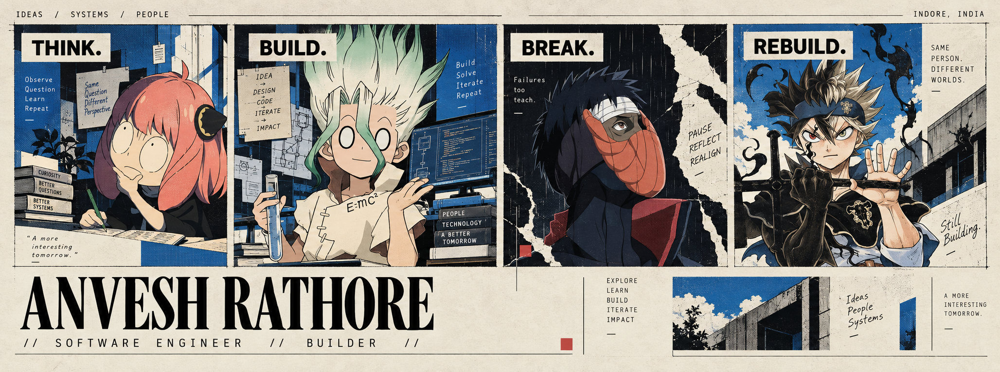

<!-- =========================================================
     ANVESH RATHORE — GITHUB PROFILE README
     Repository: anveshr312-bit/anveshr312-bit
     ========================================================= -->

<p align="center">
  
</p>

<br>

<h2>Hi, I'm <a href="https://github.com/anveshr312-bit">Anvesh</a>.</h2>

> I'm a software engineer and builder from Indore, India.  
> I like turning ideas into systems, exploring new technologies, and building things that solve meaningful problems.

<br>

<p align="center">
  <a href="https://github.com/anveshr312-bit">
    
  </a>
  &nbsp;
  <a href="www.linkedin.com/in/anveshr312">
    
  </a>
  &nbsp;
  <a href="mailto:anveshr312@gmail.com">
    
  </a>
  &nbsp;
  <a href="https://anvesh-rathore-portfolio.pages.dev/">
    
  </a>
</p>

<p align="center">
  <sub>INDORE, INDIA</sub>
  &nbsp;&nbsp;•&nbsp;&nbsp;
  <sub>BUILD • EXPLORE • LEARN • REPEAT</sub>
</p>

---

## // FEATURED PROJECTS

<table>
<tr>

<td width="50%" valign="top">

### TraceX

**Blockchain intelligence for safer investigations.**

TraceX is a blockchain-forensics platform designed to help investigators trace cryptocurrency fund flows from a suspect wallet toward exchanges and other identifiable entities.

**Built with**

`Next.js` `FastAPI` `Neo4j` `PostgreSQL` `Redis` `Etherscan`

<br>

<a href="https://github.com/apoorvgarewal07/TraceX">
  → VIEW PROJECT
</a>

</td>

<td width="50%" valign="top">

### R³P

**Rail Rapid Response Platform**

A railway-focused platform built around real-time issue reporting, tracking, and resolution workflows.

**Built with**

`Full Stack` `Next.js` `Python` `APIs` `Systems`

<br>

<a href="https://github.com/anveshr312-bit/railway-routing-service">
  → VIEW PROJECT
</a>

</td>

</tr>
</table>

---

## // TECH STACK

<table>
<tr>
<td align="center" width="11%">
  <br>
  React
</td>

<td align="center" width="11%">
  <br>
  Next.js
</td>

<td align="center" width="11%">
  <br>
  TypeScript
</td>

<td align="center" width="11%">
  <br>
  Python
</td>

<td align="center" width="11%">
  <br>
  FastAPI
</td>

<td align="center" width="11%">
  <br>
  PostgreSQL
</td>

<td align="center" width="11%">
  <br>
  Neo4j
</td>

<td align="center" width="11%">
  <br>
  Docker
</td>

<td align="center" width="11%">
  <br>
  AWS
</td>
</tr>
</table>

---

## // CURRENTLY BUILDING

```text
> Improving TraceX
> Exploring game development
> Learning more about distributed systems
> Building useful things
> Trying to be a little better than yesterday █
